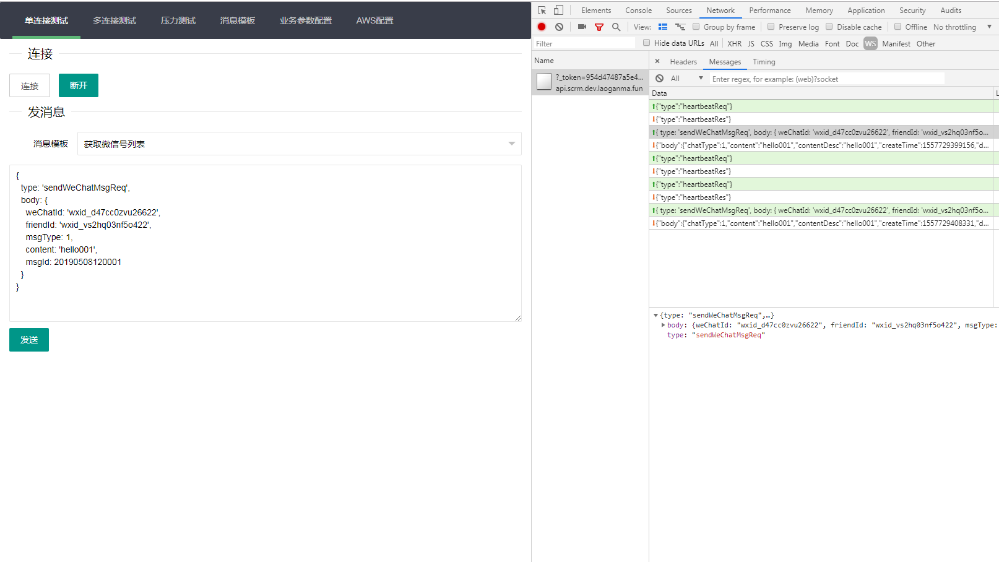
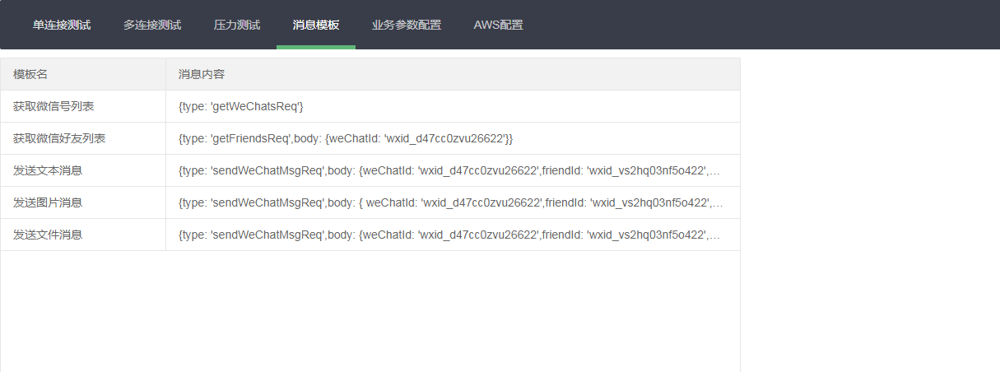
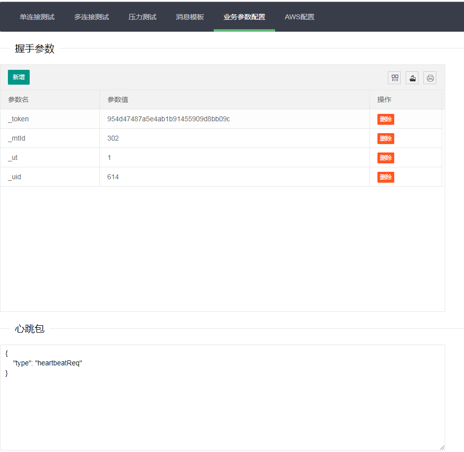
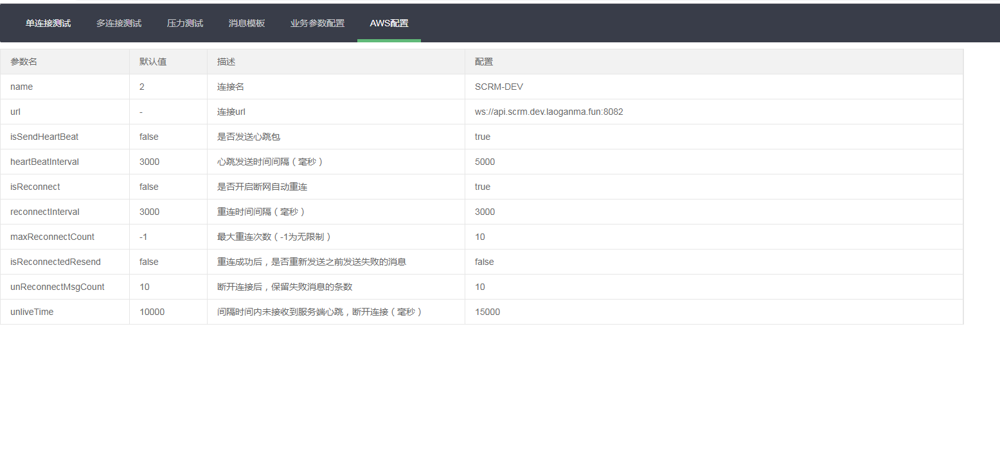

## 序言

AWS 一个前端websocket工具库。

## 信息

- `原创作者`：傲世孤尘
- `开源协议`：MIT
- `当前版本`：1.0.0
- `发布日期`：2019-04-02
- `最后更新日期`：2019-05-07
- `交流Q群`527393872 

## 特性
- 内置日志方便调试，可通过日志级别过滤
- 统计收发消息数、重连次数、重连成功时间等数据方便优化调参以及业务层优化
- 支持断线重连
- 支持失败消息重发
- 支持心跳机制

## AWS-tool示例

## 更新记录

#### 2019-04-02
- 1.0.0 版本发布

#### 2019-05-07
- Assert优化

#### 2019-05-13
- 新增aws测试工具

#### 2019-09-26
- 解决心跳包参数修改后不生效的bug